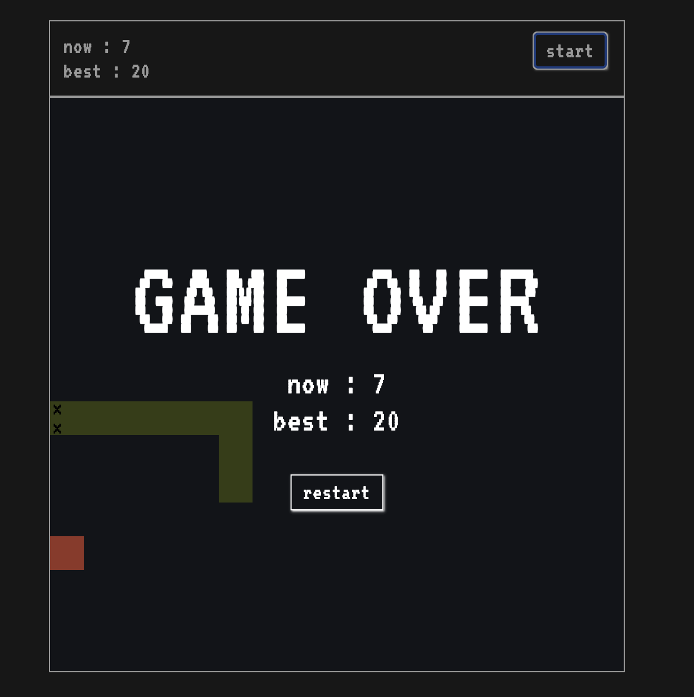

# 🐍 Snake Game

## 프로젝트 소개
자바스크립트로 직접 게임을 구현해보고 싶어서 만든 스네이크 게임입니다.  
간단한 웹 기술로 게임 개발을 경험하는 것이 목적입니다.

## 실행 방법
아래 링크에서 바로 플레이할 수 있습니다.  
[👉 게임 실행하기](https://focfoc.github.io/snake-game/index.html)

## 게임 방법
- **방향키**(↑, ↓, ←, →)로 뱀을 조작하세요.
- 사과를 먹으면 뱀의 길이가 늘어납니다.
- 벽이나 자신의 몸에 부딪히면 게임 오버입니다.

## 스크린샷

## 기술 스택
- HTML
- CSS
- JavaScript

## 향후 개선 아이디어
- 점수판 추가 예정
- 모바일 대응